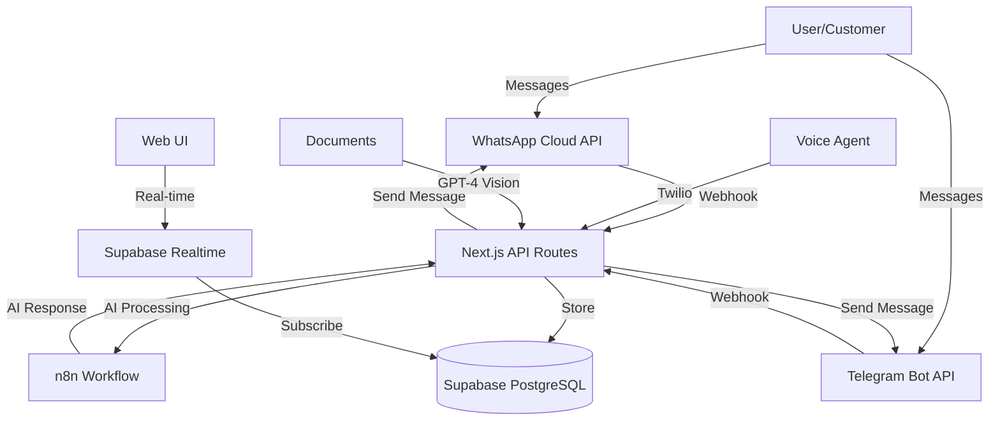

# Phase 26: Documentation & Developer Experience — Context

**Goal:** Create API documentation (OpenAPI), set up Storybook for component library, write deployment guide, add architecture diagrams.

**Source:** [codebase/CONCERNS.md](../../codebase/CONCERNS.md) — Documentation Gaps (lines 380-410)

---

## 📝 Critical Issues to Fix

### 1. No API Documentation
**Current State:**
- API routes lack comments
- No OpenAPI specification
- Webhook payload formats undocumented
- Integration partners don't know how to use APIs

**From CONCERNS.md:**
```
### No API Documentation
- Issue: API routes lack documentation (no OpenAPI spec, no comments)
- Files: All src/app/api/**/*.ts routes
- Impact: Hard for developers to understand API contracts
- Fix approach:
  - Add JSDoc comments to all route handlers
  - Consider: Generate OpenAPI spec (tRPC or Swagger)
  - Document webhook payload formats
```

**Current API routes:**
```
GET  /api/conversations
GET  /api/conversations/[id]
POST /api/conversations/[id]/messages
POST /api/conversations/[id]/takeover

GET  /api/voice/agents
POST /api/voice/agents
GET  /api/voice/calls
GET  /api/voice/phone-numbers

GET  /api/documents/jobs
POST /api/documents/upload
GET  /api/documents/templates
POST /api/documents/templates

POST /api/webhooks/whatsapp
POST /api/webhooks/telegram
POST /api/webhooks/n8n/*
POST /api/webhooks/twilio/voice
```

**All need documentation with:**
- Request schema
- Response schema
- Error responses
- Authentication requirements
- Rate limits

---

### 2. No Component Library Documentation
**Current State:**
- No Storybook setup
- Components undocumented
- Developers don't know which components exist
- No usage examples

**From CONCERNS.md:**
```
### No Component Library Documentation
- Issue: No Storybook or component docs
- Impact: Developers don't know which components exist or how to use them
- Fix approach:
  - Set up Storybook
  - Document all src/components/ui/* components
  - Add usage examples for common patterns
```

**Components to document:**
```
src/components/ui/Button.tsx         (Phase 21)
src/components/ui/Card.tsx           (Phase 21)
src/components/ui/Modal.tsx
src/components/ui/Tabs.tsx
src/components/ui/Badge.tsx
src/components/ui/Avatar.tsx
... (all UI primitives)
```

**Storybook benefits:**
- Visual component browser
- Interactive prop testing
- Usage examples
- Accessibility testing
- Design system documentation

---

### 3. No Deployment Documentation
**Current State:**
- Deployment process in one person's head
- No step-by-step guide
- Environment setup undocumented
- Troubleshooting guidance missing

**From CONCERNS.md:**
```
### No Deployment Documentation
- Issue: No docs on how to deploy, environment setup, or troubleshooting
- Impact: Bus factor risk (if one developer leaves)
- Fix approach:
  - Create DEPLOYMENT.md with step-by-step guide
  - Document environment variables
  - Add troubleshooting section
```

**Required documentation:**
- Initial setup (Supabase, Vercel, env vars)
- Local development setup
- Production deployment process
- CI/CD pipeline explanation
- Rollback procedures
- Common troubleshooting

---

### 4. No Architecture Diagrams
**Current State:**
- System architecture not visualized
- Data flow unclear
- Integration points undocumented
- New developers struggle to understand system

**Missing diagrams:**
- System architecture (high-level components)
- Database schema (ERD)
- Authentication flow
- Webhook flow (WhatsApp, Telegram, n8n)
- Real-time subscription architecture
- Multi-tenant data isolation (Phase 25)

---

## 📁 Files to Create

### API Documentation
```
docs/api/README.md                           # API overview
docs/api/openapi.yaml                        # OpenAPI 3.0 spec
docs/api/conversations.md                    # Conversational API
docs/api/voice.md                            # Voice API
docs/api/documents.md                        # Documents API
docs/api/webhooks.md                         # Webhook reference
docs/api/examples/                           # Example requests (curl, JS, Python)
```

### Component Documentation (Storybook)
```
.storybook/main.js                           # Storybook config
.storybook/preview.js                        # Global decorators
src/components/ui/Button.stories.tsx         # Button stories
src/components/ui/Card.stories.tsx           # Card stories
... (story for each component)
docs/components/README.md                    # Component guide
docs/components/design-tokens.md             # Design system tokens
```

### Deployment Documentation
```
DEPLOYMENT.md                                # Main deployment guide
docs/deployment/local-setup.md               # Local dev setup
docs/deployment/environment-variables.md     # Env var reference (links to .env.example)
docs/deployment/vercel.md                    # Vercel deployment
docs/deployment/supabase.md                  # Supabase setup
docs/deployment/troubleshooting.md           # Common issues
docs/deployment/rollback.md                  # Rollback procedures
```

### Architecture Documentation
```
docs/architecture/README.md                  # Architecture overview
docs/architecture/system-diagram.md          # High-level architecture
docs/architecture/database-schema.md         # ERD + table descriptions
docs/architecture/auth-flow.md               # Authentication flow
docs/architecture/webhook-flow.md            # Webhook processing
docs/architecture/real-time.md               # Supabase real-time architecture
docs/architecture/multi-tenancy.md           # Organization isolation (Phase 25)
```

### Onboarding
```
CONTRIBUTING.md                              # Contribution guide
docs/onboarding/README.md                    # New developer onboarding
docs/onboarding/first-task.md                # Tutorial: First contribution
docs/onboarding/codebase-tour.md             # Codebase walkthrough
```

---

## 🔧 Technical Approach

### OpenAPI Specification
**Generate from route handlers:**
```yaml
# docs/api/openapi.yaml
openapi: 3.0.0
info:
  title: AI BY SEA API
  version: 5.0.0
  description: Enterprise AI automation platform API

servers:
  - url: https://api.aibysea.com
    description: Production
  - url: http://localhost:3000
    description: Local development

paths:
  /api/conversations:
    get:
      summary: List conversations
      tags: [Conversations]
      parameters:
        - name: limit
          in: query
          schema:
            type: integer
            default: 50
      responses:
        200:
          description: Success
          content:
            application/json:
              schema:
                type: object
                properties:
                  conversations:
                    type: array
                    items:
                      $ref: '#/components/schemas/Conversation'
      security:
        - bearerAuth: []

components:
  schemas:
    Conversation:
      type: object
      properties:
        id:
          type: string
          format: uuid
        contact_name:
          type: string
        # ...
  securitySchemes:
    bearerAuth:
      type: http
      scheme: bearer
```

**Or use tRPC for automatic API types:**
- Alternative: Migrate to tRPC for type-safe APIs
- Generates OpenAPI automatically
- Better DX for full-stack TypeScript

---

### Storybook Setup
**Configuration:**
```javascript
// .storybook/main.js
module.exports = {
  stories: ['../src/**/*.stories.@(js|jsx|ts|tsx)'],
  addons: [
    '@storybook/addon-links',
    '@storybook/addon-essentials',
    '@storybook/addon-interactions',
    '@storybook/addon-a11y' // Accessibility testing
  ],
  framework: {
    name: '@storybook/nextjs',
    options: {}
  },
  staticDirs: ['../public']
}
```

**Example story:**
```typescript
// src/components/ui/Button.stories.tsx
import type { Meta, StoryObj } from '@storybook/react'
import { Button } from './Button'

const meta: Meta<typeof Button> = {
  title: 'UI/Button',
  component: Button,
  tags: ['autodocs'],
  argTypes: {
    variant: {
      control: 'select',
      options: ['primary', 'secondary', 'ghost', 'danger']
    },
    size: {
      control: 'select',
      options: ['sm', 'md', 'lg']
    }
  }
}

export default meta
type Story = StoryObj<typeof Button>

export const Primary: Story = {
  args: {
    variant: 'primary',
    children: 'Primary Button'
  }
}

export const Secondary: Story = {
  args: {
    variant: 'secondary',
    children: 'Secondary Button'
  }
}

export const WithIcon: Story = {
  args: {
    variant: 'primary',
    icon: <PlusIcon />,
    children: 'Add Item'
  }
}
```

---

### Deployment Guide Structure
**DEPLOYMENT.md:**
```markdown
# Deployment Guide

## Prerequisites
- Node.js 18+
- Git
- Supabase account
- Vercel account (or alternative)

## Initial Setup

### 1. Clone Repository
git clone ...
cd aibysea

### 2. Install Dependencies
npm install

### 3. Configure Environment Variables
cp .env.example .env.local
# Edit .env.local with your values
# See docs/deployment/environment-variables.md for details

### 4. Set Up Supabase
# Link to Supabase project
npx supabase link --project-ref your-project-ref

# Run migrations
npx supabase db push

### 5. Run Locally
npm run dev
# Open http://localhost:3000

## Production Deployment

### Vercel (Recommended)
1. Push to GitHub
2. Import repository in Vercel
3. Configure environment variables
4. Deploy

### Manual Deployment
npm run build
npm run start

## Troubleshooting
See docs/deployment/troubleshooting.md
```

---

### Architecture Diagrams
**Tools:**
- Mermaid (markdown diagrams)
- Excalidraw (visual diagrams)
- diagrams.net (formerly draw.io)

**Example: System architecture (Mermaid):**


---

## 🎯 Success Criteria

Phase 26 is complete when:

- [ ] **API Documentation:**
  - [ ] OpenAPI spec complete (all endpoints)
  - [ ] JSDoc comments on all route handlers
  - [ ] Webhook payload formats documented
  - [ ] Example requests provided (curl, JS, Python)
  - [ ] Authentication documented
  - [ ] Rate limits documented

- [ ] **Component Library:**
  - [ ] Storybook configured and running
  - [ ] All UI components have stories
  - [ ] Usage examples for each component
  - [ ] Accessibility notes included
  - [ ] Design tokens documented
  - [ ] Deployed to GitHub Pages or Vercel

- [ ] **Deployment Documentation:**
  - [ ] DEPLOYMENT.md complete
  - [ ] Local setup guide written
  - [ ] Environment variables documented
  - [ ] Vercel deployment guide written
  - [ ] Supabase setup guide written
  - [ ] Troubleshooting guide complete
  - [ ] Rollback procedures documented

- [ ] **Architecture Documentation:**
  - [ ] System architecture diagram created
  - [ ] Database ERD created
  - [ ] Auth flow documented
  - [ ] Webhook flow documented
  - [ ] Real-time architecture explained
  - [ ] Multi-tenancy architecture documented

- [ ] **Onboarding:**
  - [ ] CONTRIBUTING.md written
  - [ ] Onboarding guide created
  - [ ] Codebase tour written
  - [ ] First contribution tutorial created
  - [ ] New developer can onboard in < 2 hours

---

## 📚 Related Documentation

**Codebase analysis:**
- [codebase/CONCERNS.md](../../codebase/CONCERNS.md) — Documentation Gaps (lines 380-410)
- [codebase/STRUCTURE.md](../../codebase/STRUCTURE.md) — Current codebase structure
- [codebase/CONVENTIONS.md](../../codebase/CONVENTIONS.md) — Code conventions

**Existing docs to reference:**
- [.planning/PROJECT.md](../../PROJECT.md) — Project context
- [.planning/ROADMAP.md](../../ROADMAP.md) — Development history
- [.planning/codebase/](../../codebase/) — Codebase analysis docs
- [.env.example](.env.example) — Created in Phase 25

**External resources:**
- OpenAPI: https://swagger.io/specification/
- Storybook: https://storybook.js.org/docs/react/get-started/install
- Mermaid: https://mermaid.js.org/
- tRPC: https://trpc.io/ (alternative to OpenAPI)

---

## 🚧 Blockers & Dependencies

**Depends on:**
- Phase 25 complete (.env.example exists)
- Phase 21 complete (Button/Card components to document)
- Phase 23 complete (real APIs to document)

**Blocks:**
- None (documentation doesn't block other work)

**Risks:**
- Documentation becomes stale (needs maintenance)
- Diagrams hard to keep updated
- Storybook adds build complexity
- OpenAPI spec can be tedious to write manually

**Mitigation:**
- Automate documentation where possible (tRPC, JSDoc)
- Keep diagrams simple and high-level
- Set up GitHub Actions to build Storybook
- Use AI tools to help generate OpenAPI specs

---

## 💡 Planning Notes

**Suggested plan breakdown:**
1. **26-01:** API Documentation (OpenAPI spec, JSDoc, webhook docs, examples)
2. **26-02:** Component Library (Storybook setup, component stories, design tokens doc)
3. **26-03:** Deployment & Architecture (DEPLOYMENT.md, diagrams, onboarding guide)

**Or combine into 2 plans:**
1. **26-01:** Developer Documentation (API docs + Storybook + component guide)
2. **26-02:** Operations Documentation (deployment + architecture + onboarding)

**Estimated complexity:** Medium (lots of writing, but straightforward)

**Testing strategy:**
- Validate OpenAPI spec with validator
- Test all code examples (curl, JS, Python)
- Have new developer follow onboarding guide
- Verify Storybook builds without errors

**Maintenance plan:**
- Add docs update to definition of done
- Review docs quarterly for accuracy
- Use linting for API docs (Spectral for OpenAPI)
- Keep diagrams in version control

---

## 🎓 Documentation Best Practices

**For API docs:**
- Use real examples (not foo/bar)
- Include error responses
- Show authentication headers
- Explain rate limiting
- Link to related endpoints

**For component docs:**
- Show all variants
- Include do's and don'ts
- Accessibility notes
- Mobile considerations
- Common use cases

**For deployment docs:**
- Step-by-step instructions
- Assume minimal knowledge
- Include troubleshooting
- Link to external docs
- Keep up to date

**For architecture docs:**
- Start high-level, then drill down
- Use diagrams liberally
- Explain "why" not just "what"
- Link to code examples
- Document trade-offs

---

*Context prepared: 2026-02-02*
*Ready for: /gsd:plan-phase 26*
